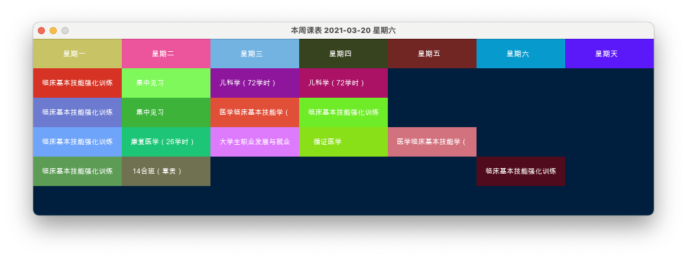
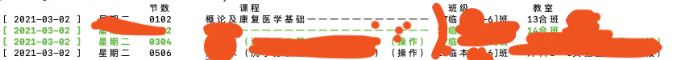

# gmuday
ruby 语言编写的赣南某学院课表解析工具(Published)

## 用法
首先使用`sudo gem install gmuday -s https://rubygems.org/`安装此库
```
require 'gmuday'

set title: 'apptitle', background: 'navy', width: 1050, height: 300
GmuDay.show("example.xlsx", 0, "19 xx [1-2]班")

show
```
三个参数分别表示*课表文件*,  *本周*，*班级*。看下周课表，第二个参数为1；看上周课表，则为-1。以此类推
，如果你想增加点击查看上课地点， [请看这里](example/README.md)

### GmuDay.parse
返回包含某些天课表的数组(Array)
```
GmuDay.parse("example.xlsx", "19 xx [1-2]班”, 1, 7)
```
> 解析不用高亮输出，参数为四个

### GmuDay.course
命令格式化打印课表，参数如下
```
GmuDay.course("example.xlsx", ["19 xx [1-2]班", "19 xx [3-4]班",],["19 xx [1-2]班",], 1, 7)
```
参数解析：  
`arg0`：课表路径，可能支持url  
`arg1`: 班级名称。介绍与下方类似  
`arg2`: 高亮输出指定班级课程，未指定则为普通色。指定多个班级用`Array`，单个班级`String`或`Array`  
`arg3 、arg4`： `0,0`表示当前一天，` 1,1`表示明天，`-1,3`表示过去一天到未来三天，`1,7`表示明天开始的未来7天，以此类推  


# Requirements
+ ruby2d
+ creek

> 如果你想要gem支持你的学校，请修改lib中对应数组 Index['']  
> 本来想做成macOS、windows、iOS跨平台应用，但是ruby2d编译的时候遇到一个issue，网络提交不上，暂时先这样
