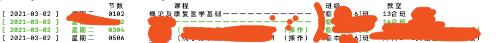

# gmuday
ruby 语言编写的赣南某学院课表解析工具

## 用法
首先使用`sudo gem install gmuday-0.1.2.gem`安装此库
```
require 'gmuday'
GmuDay.course("example.xlsx", ["19 xx [1-2]班", "19 xx [3-4]班",],["19 xx [1-2]班",] 1, 7)
```
参数解析：  
`arg0`：课表路径，可能支持url  
`arg1`: 班级名称  
`arg2`: 高亮输出指定班级课程，未指定则为普通色。指定多个班级用`Array`，单个班级`String`或`Array`  
`arg3 、arg4`： `0,0`表示当前一天，`-1,3`表示过去一天到未来三天，`1,7`表示明天开始的未来7天，以此类推  

### GmuDay.parse
返回包含某些天课表的数组(Array)
```
GmuDay.parse("example.xlsx", "17 xx [2-3]班", 1, 7)
```
> 解析不用高亮输出，参数为四个

### GmuDay.course
命令格式化打印课表，参数与上述一致


