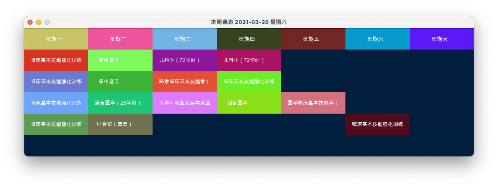

# gmuday
ruby gem to show GMU courses(Published)

## Usage
First of all, execute `sudo gem install gmuday-0.2.0.gem` to install this lib
```
require 'gmuday'
GmuDay.wind()
```
An easy way to show courses. 0 for this week while 1 for next week.



# Requirements
+ ruby2d
+ creek
+ base64_string
+ os

>  **Pass** 
